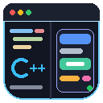

<p align="center">
  
</p>

<h1 align="center">C++ Studio & Slate Live Preview</h1>

<p align="center">
  Integrated in-engine C++ code studio, dual-pane editor, project explorer, class wizard, and <b>zero-compile</b> Slate UI live previewer for Unreal Engine 5.
</p>

---

**C++ Studio & Slate Live Preview** is an editor-only Unreal Engine plugin that brings a full-featured, productive C++ code editing environment and an instant, real-time Slate UI previewer directly inside Unreal Editor. 

Stop switching back and forth between external IDEs, waiting minutes for compilation just to tweak padding or colors on a widget, or guessing how your UI looks. Write C++, inspect your project hierarchy, generate classes, refactor files, trigger Live Coding, and preview declarative Slate UI in **0 milliseconds** without leaving the editor.

> Available on Fab. This repository hosts the public documentation and issue tracker for the plugin.

---

## Features

### 🖥️ In-Engine C++ Studio & Dual-Pane Editor
- **Side-by-side editing**: View and edit `.h` header and `.cpp` source files simultaneously with independent split panes.
- **Multi-tab management**: Open unlimited tabs with smart tab actions (Close Others, Close All, Move to Other Split Pane, Reveal in Explorer).
- **Active pane tracking**: Visual accent borders indicate the focused editor pane.
- **Quick Switch**: Jump instantly between `.h` and `.cpp` with `Alt + O`.
- **Full Undo / Redo**: Standard `Ctrl + Z` and `Ctrl + Y` history tracking.
- **Integrated Search & Replace**: Find terms across open documents with match counter and navigation.
- **Quick Open palette (`Ctrl + P`)**: Instant fuzzy file searching across the entire project and plugin codebase.

### ⚡ Real-Time Slate Live Preview (0ms Compilation)
- **Zero-compilation preview**: Built-in declarative AST interpreter parses Slate syntax (`SNew`, `.Padding`, `.ColorAndOpacity`, slots `+ Slot()`, operators `[ Content ]`) and instantiates real native Unreal Slate widgets on the fly.
- **Interactive UI mocking**: Click buttons, toggle checkboxes, drag sliders, and inspect real-time interaction logs.
- **Flexible viewport controls**: Dark, Light, and Checkerboard backgrounds; preset preview viewports (400x300, 800x600, Auto).
- **Background File Watcher**: Automatically refreshes the live preview when files are saved in external IDEs (Visual Studio, Rider, VS Code, Cursor).
- **Auto Snapshot Export**: Renders a crisp screenshot to `Saved/SlateLivePreview/preview.png` on every edit — ideal for visual review and autonomous AI agent loops.

### 🪄 Unreal-Style "Add C++ Class" Wizard
- **Visual card picker**: Select from Character, Pawn, Actor, ActorComponent, SceneComponent, Slate Widget, UObject, UStruct, or Empty C++ Class.
- **Smart prefix validation**: Automatically enforces Unreal naming conventions (`AMyCharacter`, `UInventoryComponent`, `SMyWidget`, `FItemData`) and prevents duplicate prefixes (e.g. `AMyCharacter` produces class `AMyCharacter` in file `MyCharacter.h`, never `AAMyCharacter`).
- **Module & API detection**: Automatically resolves the correct target module and export macro (`PROJECT_API` or `PLUGIN_API`).
- **Compilable boilerplate**: Generates clean, compilation-ready header and source files with all necessary includes and `GENERATED_BODY()`.

### 📁 Project Explorer & Safe Refactoring
- **Full C++ tree**: Browse all project and plugin source files in a clean, categorized tree view.
- **Symbol-aware Rename Refactoring**: Renames companion `.h` and `.cpp` files together, updates `#include` statements, updates class declaration names, and synchronizes open editor tabs.
- **Context actions**: Create new classes in specific directories, delete files, reveal in Explorer, or copy paths.

### 💡 Quick Fixes & Developer Ergonomics
- **Generate Definition in .cpp**: Right-click any function declaration in a header file or press the Quick Fix button to generate the complete function skeleton in the companion `.cpp` file (including class qualification, parameter types, include insertion, and stripping `virtual`/`FORCEINLINE`/export macros).
- **Smart indentation**: Preserves indentation levels on `Enter`, with 4-space tab and backspace alignment.
- **IntelliSense auto-completion**: Contextual popups for C++ language keywords, Unreal reflection macros (`UCLASS`, `UPROPERTY`, `UFUNCTION`, `GENERATED_BODY`), engine types, Slate widgets, and member access (`->`, `.`).

### 🔨 Live Coding & Build Dashboard
- **One-click compilation**: Trigger Live Coding (`Ctrl + Alt + F11`) directly from the studio toolbar.
- **Real-time status**: Clear status badges (`Ready`, `⚡ Compiling...`, `✓ Success`, `✕ Failed`).
- **Embedded build log**: Real-time compiler output console without obscuring your view.

---

## Supported Engine Versions

| Engine | Status |
| --- | --- |
| Unreal Engine 5.8 | Primary target (Workspace verified) |
| Unreal Engine 5.7 | Supported |
| Unreal Engine 5.6 | Supported |
| Unreal Engine 5.5 | Supported |

---

## Installation

### From Fab (Recommended)
1. Install **C++ Studio & Slate Live Preview** via the Epic Games Launcher / Fab library.
2. In Unreal Editor, open **Edit → Plugins**, find **C++ Studio & Slate Live Preview**, and check **Enabled**.
3. Restart the Editor when prompted.

### Manual Installation
1. Download or copy the `SlateLivePreview` folder into your project's `Plugins/` directory:
   `[ProjectRoot]/Plugins/SlateLivePreview/`
2. Right-click your `.uproject` file and select **Generate Visual Studio project files**.
3. Build the Editor target in your IDE or launch Unreal Editor directly.
4. Enable the plugin in **Edit → Plugins**.

---

## Getting Started

1. Open the studio from the main menu:
   - **Tools → C++ Studio** (or **Tools → Slate Live Preview**)
   - Alternatively: **Window → C++ Studio**
2. Browse your project files in the left sidebar tree, or press `Ctrl + P` to quickly open any file.
3. Open a companion header or source file and choose **Move to Other Split Pane** from the tab context menu to edit side-by-side.
4. When writing Slate UI, switch to the **Live Preview** tab to see your widgets rendered live as you type.
5. Hit **Ctrl + Alt + F11** or click **⚡ Live Coding** in the toolbar to compile your changes.

---

## Keyboard Shortcuts

| Shortcut | Action |
| --- | --- |
| `Ctrl + P` | Quick Open file palette |
| `Ctrl + S` | Save current file |
| `Alt + O` | Switch between Header (`.h`) and Source (`.cpp`) |
| `Ctrl + Z` | Undo |
| `Ctrl + Y` | Redo |
| `Ctrl + F` | Open Find / Replace bar |
| `Ctrl + Alt + F11` | Trigger Live Coding compile |
| `Tab` | Indent (4 spaces) |
| `Shift + Tab` | Unindent |
| `Esc` | Close Quick Open / Dismiss menus |

---

## Supported Slate Widgets & Properties

| Category | Widgets | Key Attributes & Slots |
| --- | --- | --- |
| **Containers** | `SBorder`, `SVerticalBox`, `SHorizontalBox`, `SOverlay`, `SBox`, `SScrollBox`, `SSpacer`, `SSeparator` | `BorderBackgroundColor`, `Padding`, `HAlign`, `VAlign`, `AutoHeight`, `AutoWidth`, `FillHeight`, `FillWidth`, `MaxHeight`, `MaxWidth`, `WidthOverride`, `HeightOverride`, `Size`, `Thickness` |
| **Display** | `STextBlock`, `SImage`, `SColorBlock` | `Text`, `ColorAndOpacity`, `Font`, `Justification`, `AutoWrapText`, `Color`, `Size`, `DesiredSizeOverride` |
| **Controls** | `SButton`, `SCheckBox`, `SEditableTextBox`, `SMultiLineEditableTextBox`, `SSlider`, `SProgressBar` | `ButtonColorAndOpacity`, `ContentPadding`, `IsEnabled`, `IsChecked`, `HintText`, `IsReadOnly`, `Value`, `MinValue`, `MaxValue`, `Percent`, `FillColorAndOpacity` |

---

## 🤖 AI Coding Agent Workflow

When collaborating with autonomous AI coding agents (Claude Code, Cursor, Copilot, ChatGPT Codex):

```
1. AI Agent writes or modifies a Slate widget in your project source:
   Source/MyGame/UI/SHealthBar.cpp

2. SlateLivePreview FileWatcher detects the file change instantly.

3. The parser executes in 2 ms and auto-exports an image snapshot:
   [ProjectRoot]/Saved/SlateLivePreview/preview.png

4. The AI agent inspects preview.png directly:
   - Evaluates padding, layout balance, contrast, typography
   - Refines parameters in code iteratively

5. Complete UI iteration loop in seconds with zero compilation wait!
```

---

## Technical Specifications

- **Plugin Type**: Editor-Only code plugin (`Type: Editor`).
- **Target Platforms**: Windows (Win64), macOS, Linux.
- **Safety**: Zero asset mutation (`.uasset` files are never touched or dirtied).
- **Telemetry**: Zero telemetry, zero external network calls, completely offline.
- **Dependencies**: Uses only public Unreal Engine core and Slate modules (`Core`, `CoreUObject`, `Engine`, `Slate`, `SlateCore`, `InputCore`, `DirectoryWatcher`, `Projects`, `LiveCoding`).

---

## Support & Issues

Found a bug or have a feature request?
- **[Open an Issue](https://github.com/badbadgerentertainment-hue/Slate-Live-Preview/issues)**
- Please specify your Unreal Engine version, OS, and detailed reproduction steps.

---

## License

Copyright © 2026 JMPingvin. All Rights Reserved. This documentation is provided for licensed users of the C++ Studio & Slate Live Preview plugin.
