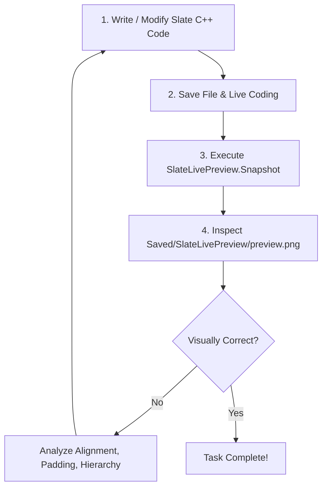

# Slate Live Preview & C++ Studio: AI Agent Automation & Visual Inspection Guide

> **Target Audience:** AI Coding Assistants (Antigravity, Claude Code, Cursor, GitHub Copilot) and Human Developers.
> **Plugin:** `SlateLivePreview` (Unreal Engine 5.2 - 5.8+)

---

## 1. Executive Summary

This guide provides instructions and reference architecture for AI agents to write, test, visually inspect, and iterate on Unreal Engine Slate C++ UI widgets autonomously.

With **Slate Live Preview & C++ Studio**, AI agents can:
1. Write declarative Slate C++ UI code.
2. Trigger in-engine compilation and live-preview rendering.
3. Capture a pixel-accurate visual snapshot of the rendered UI widget into a PNG file.
4. Inspect the image using multimodal vision (`view_file`), analyze layout balance, alignment, and styling, and refine the code autonomously.

---

## 2. Autonomous Visual Inspection Loop (AI Agent Workflow)

Follow this 5-step loop when tasked with creating or refining Slate UI:



### Step 1: Write Slate C++ Code
Write your widget declaration (`SMyWidget.h`) and definition (`SMyWidget.cpp`).
You can use the built-in wizard or generate boilerplate directly.

### Step 2: Live Update
When editing code in the in-engine **C++ Studio**, saving (`Ctrl+S`) or clicking **Live Coding** (`Ctrl+B`) instantly updates the running widget in the live preview viewport.

### Step 3: Capture Visual Snapshot
Run the engine console command:
```text
SlateLivePreview.Snapshot
```
Optional custom path:
```text
SlateLivePreview.Snapshot "Saved/SlateLivePreview/my_custom_view.png"
```
The snapshot is captured with full alpha transparency and exact Slate rendering dimensions.
Default file location:
`Saved/SlateLivePreview/preview.png`

### Step 4: Inspect the Snapshot
Use the `view_file` tool to inspect `preview.png`:
```json
{
  "AbsolutePath": "<ProjectDir>/Saved/SlateLivePreview/preview.png",
  "toolAction": "Inspecting UI snapshot",
  "toolSummary": "UI Visual Review"
}
```

### Step 5: Evaluate & Refine
Check the image for:
- **Spacing & Padding:** Are items clustered or disproportionately spaced?
- **Hierarchy:** Are headers distinct from body copy? Are primary buttons prominent?
- **Clipping:** Did text or child widgets get truncated?
- **Color contrast:** Is text readable against the container background?

---

## 3. Slate Declarative Syntax Quick Reference

### 3.1 SNew vs SAssignNew
```cpp
// SNew creates a widget without keeping a member pointer
SNew(STextBlock).Text(FText::FromString(TEXT("Hello World")));

// SAssignNew creates a widget and assigns it to a TSharedPtr member
SAssignNew(MyButtonPtr, SButton)
.Text(FText::FromString(TEXT("Click Me")));
```

### 3.2 Layout Containers & Slot Syntax

#### SVerticalBox (Column layout)
```cpp
SNew(SVerticalBox)
+ SVerticalBox::Slot()
.AutoHeight()
.Padding(4.0f)
[
    SNew(STextBlock).Text(FText::FromString(TEXT("Title")))
]
+ SVerticalBox::Slot()
.FillHeight(1.0f) // Takes all remaining vertical space
[
    SNew(SScrollBox)
]
```

#### SHorizontalBox (Row layout)
```cpp
SNew(SHorizontalBox)
+ SHorizontalBox::Slot()
.AutoWidth()
.VAlign(VAlign_Center)
.Padding(2.0f, 0.0f)
[
    SNew(SImage).Image(FAppStyle::Get().GetBrush("Icons.Save"))
]
+ SHorizontalBox::Slot()
.FillWidth(1.0f)
.VAlign(VAlign_Center)
[
    SNew(STextBlock).Text(FText::FromString(TEXT("Label")))
]
```

#### SOverlay (Stacked layers)
```cpp
SNew(SOverlay)
+ SOverlay::Slot() // Background
[
    SNew(SImage).Image(FAppStyle::Get().GetBrush("WhiteBrush"))
]
+ SOverlay::Slot() // Foreground
.HAlign(HAlign_Center)
.VAlign(VAlign_Center)
[
    SNew(STextBlock).Text(FText::FromString(TEXT("Centered Badge")))
]
```

#### SBorder (Container with background and border styling)
```cpp
SNew(SBorder)
.BorderImage(FAppStyle::Get().GetBrush("ToolPanel.GroupBorder"))
.BorderBackgroundColor(FLinearColor(0.12f, 0.12f, 0.15f, 1.0f))
.Padding(8.0f)
[
    /* Content */
]
```

### 3.3 Common Interactive Widgets

| Widget | Common Attributes |
|---|---|
| `STextBlock` | `.Text(...)`, `.Font(...)`, `.ColorAndOpacity(...)`, `.HighlightText(...)` |
| `SButton` | `.OnClicked(...)`, `.ButtonStyle(...)`, `.ButtonColorAndOpacity(...)`, `.ContentPadding(...)` |
| `SEditableTextBox` | `.Text(...)`, `.HintText(...)`, `.OnTextChanged(...)`, `.OnTextCommitted(...)` |
| `SCheckBox` | `.IsChecked(...)`, `.OnCheckStateChanged(...)`, `.Type(ESlateCheckBoxType::CheckBox)` |
| `SProgressBar` | `.Percent(...)`, `.BarFillType(...)`, `.FillColorAndOpacity(...)` |
| `SScrollBox` | `.Orientation(Orient_Vertical)`, `.ScrollBarAlwaysVisible(false)` |

---

## 4. Built-in AI Copilot Subsystem in C++ Studio

The plugin includes an in-engine AI Copilot supporting local offline LLMs and cloud providers:

### Supported Providers
1. **Local Ollama** (100% Free, Private, Offline):
   - Default Endpoint: `http://localhost:11434/v1`
   - Recommended Models: `qwen2.5-coder:7b`, `codellama:7b`, `deepseek-coder`
2. **LM Studio**:
   - Default Endpoint: `http://localhost:1234/v1`
3. **DeepSeek API**:
   - Default Endpoint: `https://api.deepseek.com/v1`
   - Model: `deepseek-chat`
4. **OpenAI**:
   - Default Endpoint: `https://api.openai.com/v1`
   - Model: `gpt-4o-mini`
5. **Custom Endpoint**:
   - Any OpenAI-compatible `/v1/chat/completions` endpoint.

### Editor Interactions
- **Ghost Text Inline Autocomplete:** Displays semi-transparent gray predictions at the cursor after typing stops (~400ms debounce).
- `Tab` &rarr; Accept ghost completion.
- `Escape` &rarr; Dismiss ghost text.
- `Alt + /` &rarr; Force trigger AI inline completion at current cursor.
- **AI Assistant Drawer:** Click the **AI Assistant** button in the C++ Studio toolbar to open the conversational assistant panel. Includes quick prompts (`+ New Slate Widget`, `Explain Error`) and a 1-click `[-> Insert at Cursor]` code injector.

---

## 5. Console Command Reference

| Command | Arguments | Description |
|---|---|---|
| `SlateLivePreview.Snapshot` | `[OptionalFilePath]` | Captures the active Slate Live Preview viewport into a PNG image. Defaults to `Saved/SlateLivePreview/preview.png`. |
| `SlateLivePreview.OpenTab` | *None* | Focuses or opens the standalone Slate Live Preview tab. |
| `SlateLivePreview.OpenStudio` | *None* | Focuses or opens the full In-Engine C++ Studio tab. |
